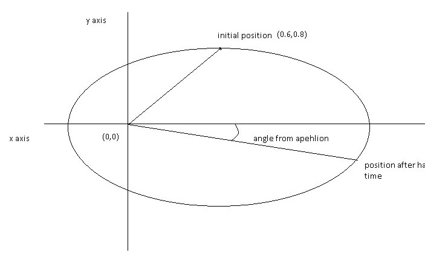
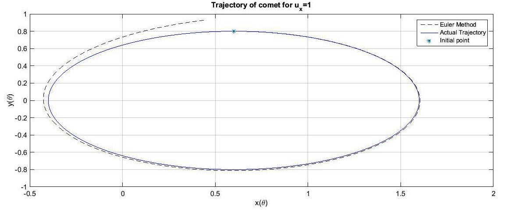
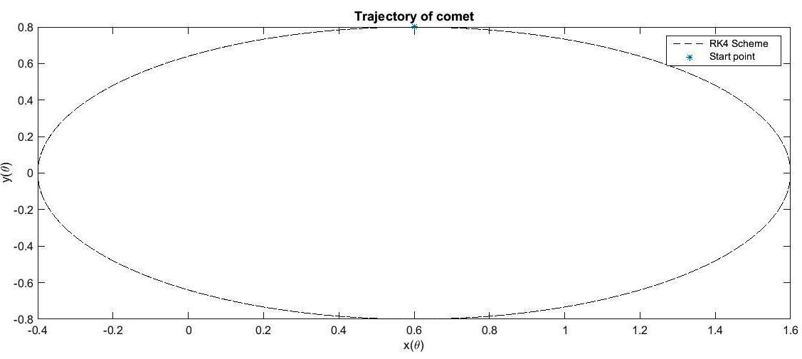
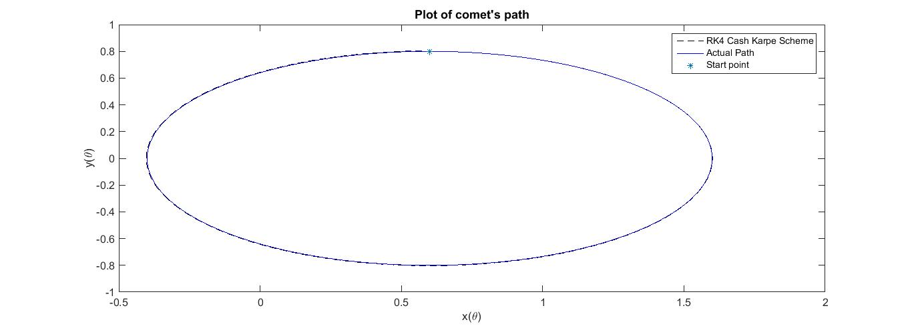
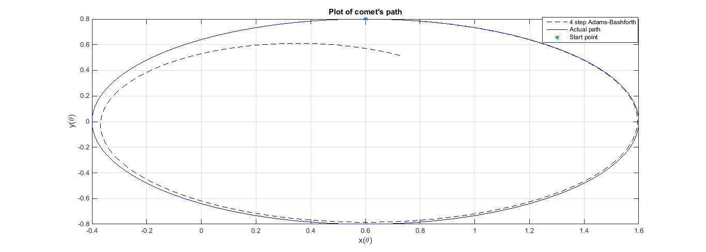
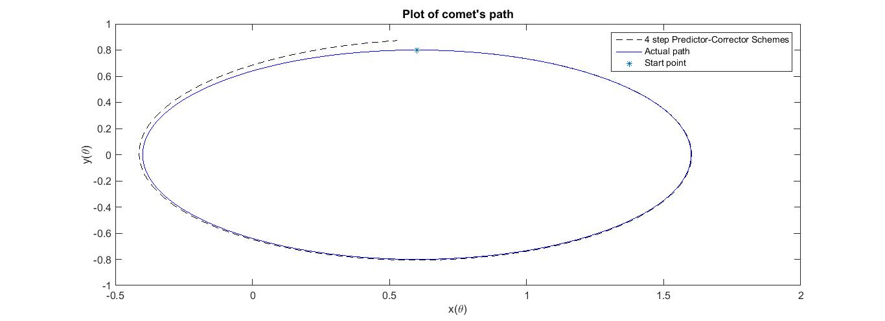
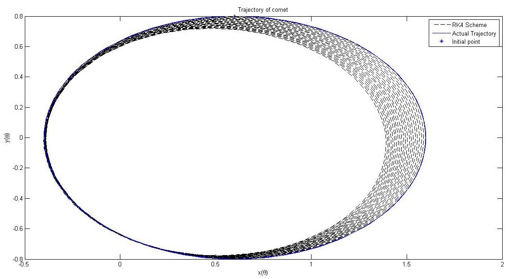

# Keplers Orbit

This is the famous comet problem solved using five different schemes viz., Euler's method, Runge-Kutte 4th order, Runge Kutte Cash Karp scheme, Adams BashForth 3rd order and Adams-Bashforth 3rd order Predictor corrector scheme

The initial position is as shown below:

## Euler's scheme

Following figure shows the solution using Eulers method

## Runge Kutte 4th order

## Runge Kutta Cash Karp Scheme

## Adams-Bashforth third order

## Adams Bashforth fourth order predictor corrector followed by Adams Moulton 

## 50 periods of RK4 with steps=2^10: Effect of step size

